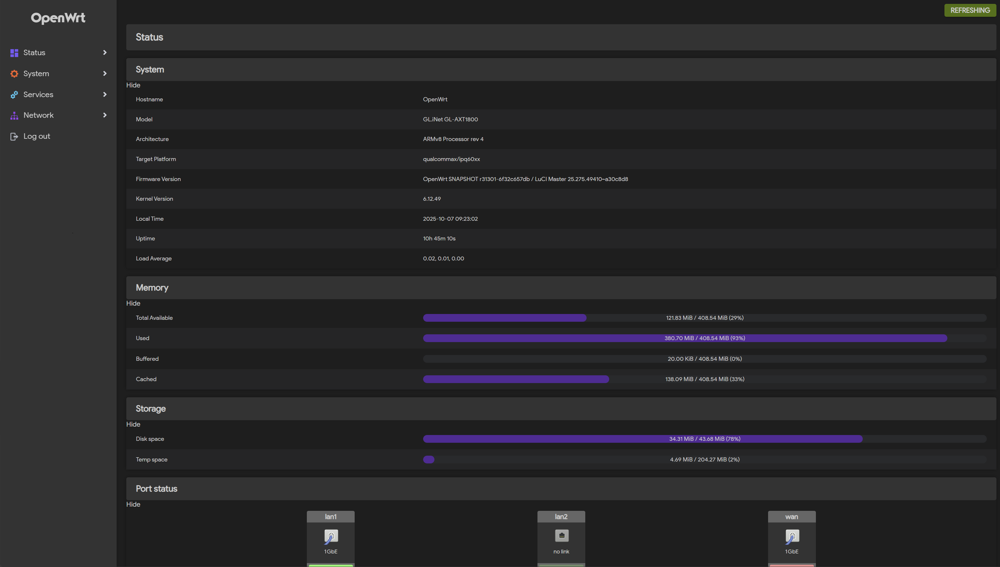

# luci-app-fancontrol
OpenWrt fan control for GL-AXT1800

Openwrt 风扇控制，读取系统温度，通过PID调节风扇控制pwm，仅针对GL-AXT1800调试过。
源码参考：https://github.com/JiaY-shi/fancontrol

## 说明
1. 使用PID控制取代原来的插值线性化控制。
2. 增加温度记录，考虑到空间和实用性，仅记录1小时。
3. 使用温度记录生成趋势图。
4. 趋势图使用鼠标获取曲线位置温度信息。

## 补充
1. 个人使用，pid参数也没有认真调节，凑合用用可以的。
2. 本身温度传感器的响应速度和精度也一般，包括PWM调节范围有限，控制在正负0.5℃够用了。
3. 佛系更新，也可能不会再更新了，能用就行了。
4. 不对源码及其导致的任何问题负责。

## 预览

